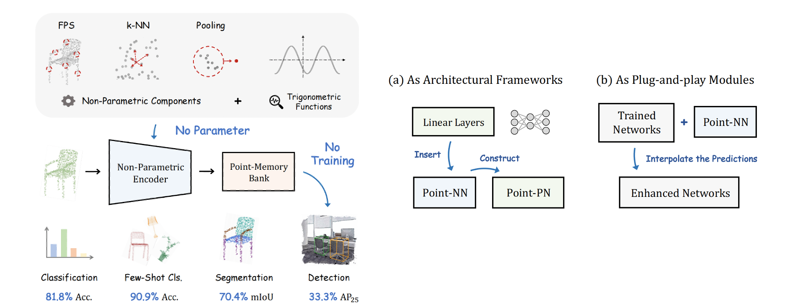

# Parameter is Not All You Need

Official implementation of ['Parameter is Not All You Need: Starting from Non-Parametric Networks for 3D Point Cloud Analysis'](https://arxiv.org/pdf/2303.08134.pdf).

The paper has been accepted by **CVPR 2023** 🔥.

[](https://paperswithcode.com/sota/training-free-3d-point-cloud-classification?p=parameter-is-not-all-you-need-starting-from)

## News
* For the first time, we conduct 3D analysis entirely requiring $\color{darkorange}{No\ Parameter\ or\ Training\.}$ 💥
* The code of Point-NN for shape classification has been released. 
* Point-PN and Point-NN for other 3D tasks will be open-sourced soon 📌.

## Introduction
We present a **N**on-parametric **N**etwork for 3D point cloud analysis, **Point-NN**, which consists of purely non-learnable components. Surprisingly, requiring no parameters or training, it performs well on various 3D tasks, and even surpasses existing fully trained models. Starting from this basic non-parametric model, we propose two extensions. 
First, Point-NN can serve as a base architectural framework to construct **P**arametric **N**etworks, **Point-PN**, which exhibits superior performance with simple linear layers. 
Second, Point-NN can be regarded as a plug-and-play module to enhance the already trained 3D models during inference by complementary knowledge.

<div align="center">
  
</div>

## Requirements
### Installation
Create a conda environment and install dependencies:
```bash
git clone https://github.com/ZrrSkywalker/Point-NN.git
cd Point-NN

conda create -n pointnn python=3.7
conda activate pointnn

# Install the according versions of torch and torchvision
conda install pytorch torchvision cudatoolkit

pip install -r requirements.txt
pip install pointnet2_ops_lib/.
```

### Dataset
Please download the following datasets: [ModelNet40](https://shapenet.cs.stanford.edu/media/modelnet40_ply_hdf5_2048.zip), [ScanObjectNN](https://hkust-vgd.ust.hk/scanobjectnn/h5_files.zip), and [ShapeNetPart](https://shapenet.cs.stanford.edu/media/shapenetcore_partanno_segmentation_benchmark_v0_normal.zip). Then, create a `data/` folder and organize the datasets as
```
data/
|–– h5_files/
|–– modelnet40_ply_hdf5_2048/
|–– shapenetcore_partanno_segmentation_benchmark_v0_normal/
```

## Point-NN --- Very Quick Implementation 🚀
### Shape Classification
Due to the training-free manner, the preparation and inference of Point-NN only take **2 minutes**.

For ModelNet40 dataset, just run:
```bash
python run_nn_cls.py --dataset mn40
```

For ScanObjectNN dataset, just run:
```bash
python run_nn_cls.py --dataset scan --split 1
```
Please indicate the splits at `--split` by `1,2,3` for OBJ-BG, OBJ-ONLY, and PB-T50-RS, respectively.


## Citation
```bash
@inproceedings{zhang2023parameter,
  title={Parameter is Not All You Need: Starting from Non-Parametric Networks for 3D Point Cloud Analysis},
  author={Zhang, Renrui and Wang, Liuhui and Wang, Yali and Gao, Peng and Li, Hongsheng and Shi, Jianbo},
  booktitle={Proceedings of the IEEE/CVF Conference on Computer Vision and Pattern Recognition},
  year={2023}
}
```

## Contact
If you have any question about this project, please feel free to contact zhangrenrui@pjlab.org.cn.
